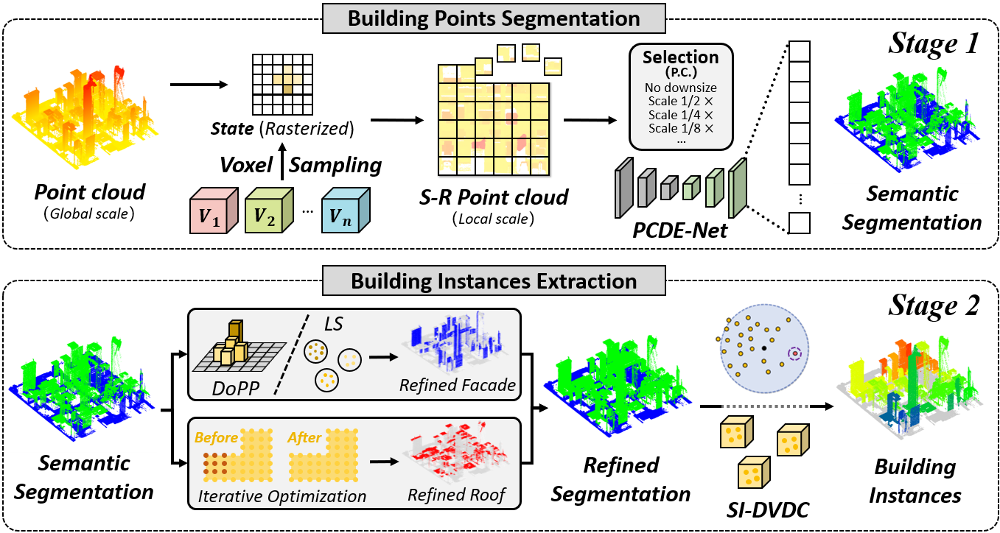

# SBIS: Structure-aware Building Instance Segmentation from Urban-Level Airborne LiDAR Point Clouds

## Abstract

  City-level building instance segmentation from LiDAR point cloud is of great significance to urban planning management, disaster response and recovery, and land resource management. However, due to the complexity of urban environment and sparse nature of LiDAR data, existing methods are often limited by the problems of obscured building boundaries and incomplete building structures, particularly in densely populated urban areas with diverse architectural styles. To address these challenges, we proposed a top-down pipeline that automatically extracts individual buildings from airborne LiDAR point clouds and is especially aware to the building structures. The proposed method encompasses two main stages, building points semantic segmentation and individual building extraction. First, we design a lightweight semantic segmentation network, PCDE-Net, that innovatively combines vertical principal component descriptor by introducing the weighted point cloud voxels, to efficiently extract buildings from large-scale point cloud. Second, an optimization strategy based on building structure perception is introduced to refine building boundaries and roof integrity. Based on the refined building points, building instances are automatically and robustly extracted using a graph-based algorithm SI-DVDC, which comprehensively considers both building structure property at the object-level and density accessibility at the point-level. The proposed method is evaluated and validated on two public benchmark datasets, as well as a dataset SYSU-3DINS provided by this paper. For the semantics, OA and mIoU metric reach 88.72% and 77.50%, which is 1.68% and 5.95% higher than the state-of-the-art methods, respectively; for the building instance, the instance-level quality on the three datasets are 87.64%, 81.49%, 76.97%, respectively. The experiments verify that the proposed method is capable of extracting individual buildings from different complex urban and rural environments, while being aware of diverse building structures, thereby demonstrating a good generalization ability. To facilitate future research, we make our dataset and source code publicly available.

   

## Dataset Download

  We provide the SYSU-3DINS Dataset to address the current absence of benchmark datasets for building instance extraction. The SYSU-3DINS Dataset encompasses nearly 7,000 buildings of various types within an area of 9.6 square kilometre, which is organised in a well-structured manner and contains two parts. The first part is the original version of the dataset, that contains point clouds with building instance ID annotations for eight representative regions. The second part is the finely labelled version of the dataset, that adds the fine-grained attribute annotations of the buildings (e.g., roof type, height and coverage, etc.).

## Building Semantic Segmentation

  You can try the fast and efficient building points segmentation via PCDE-Net. Before training, the input point cloud must be properly normalised. The codes of data preprocessing and training will be released soon.

## Building Instance Extraction

  To automatically assign instance-level building IDs, you can use the SI-DVDC method, code to be released soon.

## Contact us

  For any questions,please contact us via lijp57@mail2.sysu.edu.cn.
